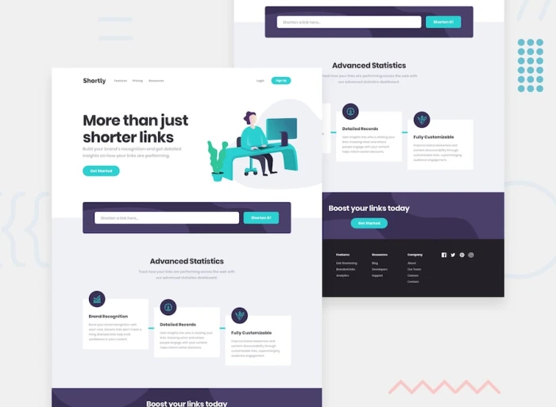
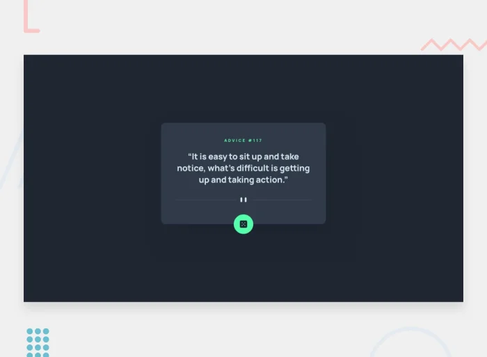
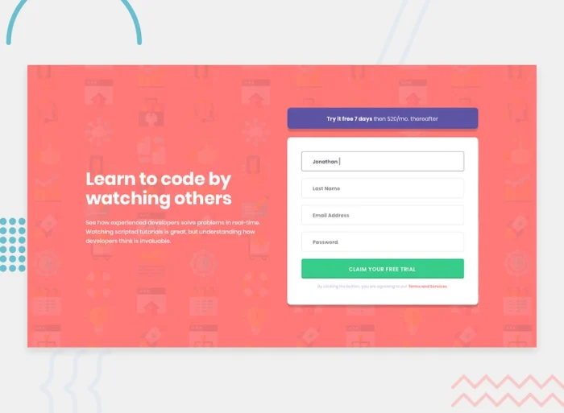
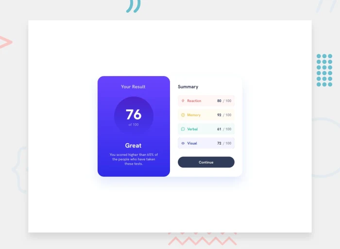

# FrontendMentor
challenges' solutions I submitted at frontendmentor.io

### URL shortening API landing page

### Advice generator app

### Intro component with sign-up form

### Results summary component
