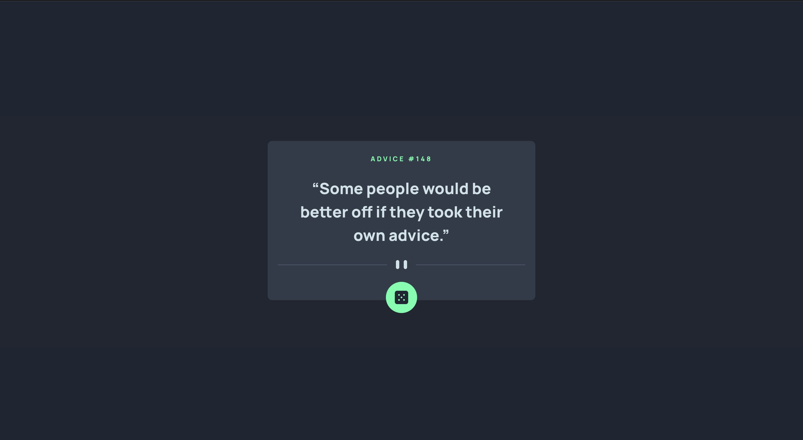

# Frontend Mentor - Advice generator app solution

This is a solution to the [Advice generator app challenge on Frontend Mentor](https://www.frontendmentor.io/challenges/advice-generator-app-QdUG-13db). Frontend Mentor challenges help you improve your coding skills by building realistic projects.

## Table of contents

- [Overview](#overview)
  - [The challenge](#the-challenge)
  - [Screenshot](#screenshot)
  - [Links](#links)
- [My process](#my-process)
  - [Built with](#built-with)
  - [Useful resources](#useful-resources)
- [Author](#author)

## Overview

### The challenge

Users should be able to:

- View the optimal layout for the app depending on their device's screen size
- See hover states for all interactive elements on the page
- Generate a new piece of advice by clicking the dice icon

### Screenshot

### Links

- Solution URL: [solution URL](https://www.frontendmentor.io/solutions/responsive-advice-generator-made-with-react-and-tailwind-css-CqPh8kpN9S)
- Live Site URL: [live site](https://spiffy-custard-ebdb7f.netlify.app/)

## My process

### Built with

- Semantic HTML5 markup
- CSS custom properties
- Mobile-first workflow
- [React](https://reactjs.org/) - JS library
- [Tailwind CSS](https://tailwindcss.com/) - For styles

### Useful resources

- [Display svg in react](https://stackoverflow.com/questions/52163810/how-do-i-reference-a-local-svg-in-react)
- [Using Google Fonts in Tailwind project](https://www.elvisduru.com/blog/how-to-add-google-fonts-tailwind)
- [Random Advice API](https://api.adviceslip.com/)
- [Center Elements with Tailwind](https://daily-dev-tips.com/posts/center-elements-with-tailwind-css/)

## Author

- Frontend Mentor - [@NotPerr](https://www.frontendmentor.io/profile/NotPerr)
- Twitter - [@NotPerry8811](https://www.twitter.com/NotPerry8811)

