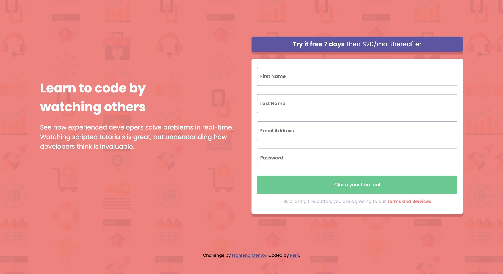

# Frontend Mentor - Intro component with sign up form solution

This is a solution to the [Intro component with sign up form challenge on Frontend Mentor](https://www.frontendmentor.io/challenges/intro-component-with-signup-form-5cf91bd49edda32581d28fd1). Frontend Mentor challenges help you improve your coding skills by building realistic projects. 

## Table of contents

- [Overview](#overview)
  - [Screenshot](#screenshot)
  - [Links](#links)
- [My process](#my-process)
  - [Built with](#built-with)
  - [Useful resources](#useful-resources)
- [Author](#author)

## Overview

### Screenshot

### Links

- Solution URL: [my solution here](https://www.frontendmentor.io/solutions/responsive-sign-up-form-with-customize-error-message-ySfn8vXaR3)
- Live Site URL: [Live Site Here](https://stupendous-chimera-292222.netlify.app/)

## My process

### Built with

- Semantic HTML5 markup
- CSS custom properties
- Flexbox
- CSS Grid
- Mobile-first workflow

### Useful resources

- [addEventListener's third parameter](https://stackoverflow.com/questions/17564323/what-does-the-third-parameter-false-indicate-in-document-addeventlistenerdev) - This helped me understand the third parameter of addEventListener.
- [Customize Form invalid message](https://codepen.io/javascriptacademy-stash/pen/oNeNMNR) - This helped me to implement customized error message.

## Author

- Frontend Mentor - [@NotPerr](https://www.frontendmentor.io/profile/NotPerr)
- Twitter - [@NotPerry8811](https://www.twitter.com/NotPerry8811)

