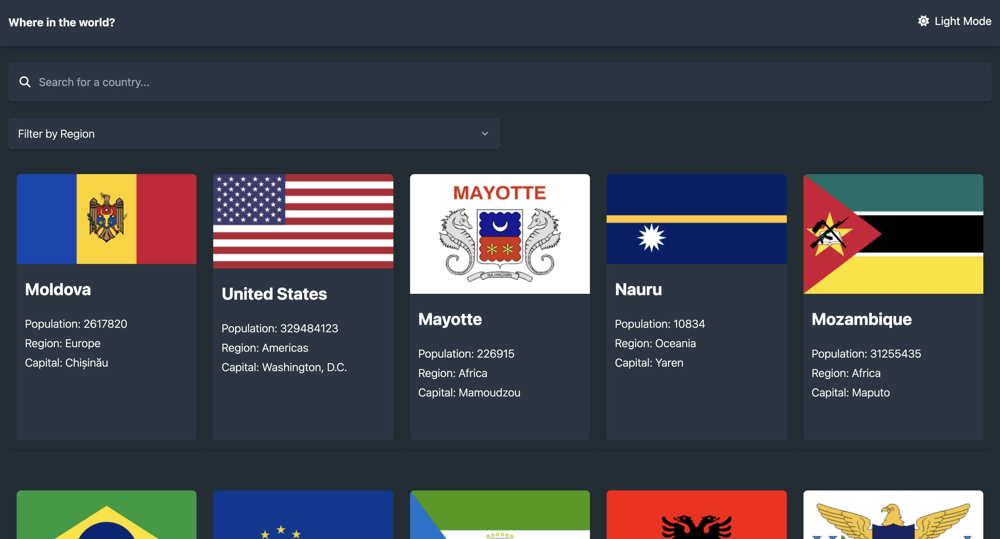

# Frontend Mentor - REST Countries API with color theme switcher solution

This is a solution to the [REST Countries API with color theme switcher challenge on Frontend Mentor](https://www.frontendmentor.io/challenges/rest-countries-api-with-color-theme-switcher-5cacc469fec04111f7b848ca). Frontend Mentor challenges help you improve your coding skills by building realistic projects.

## Table of contents

- [Overview](#overview)
  - [The challenge](#the-challenge)
  - [Screenshot](#screenshot)
  - [Links](#links)
- [My process](#my-process)
  - [Built with](#built-with)
  - [Useful resources](#useful-resources)
- [Author](#author)

## Overview

### The challenge

Users should be able to:

- See all countries from the API on the homepage
- Search for a country using an `input` field
- Filter countries by region
- Click on a country to see more detailed information on a separate page
- Click through to the border countries on the detail page
- Toggle the color scheme between light and dark mode _(optional)_

### Screenshot

### Links

- Solution URL: [Add solution URL here](https://your-solution-url.com)
- Live Site URL: [live site here](https://6631065f1ad8c41e1a02e280--merry-starship-f8504e.netlify.app/)

## My process

### Built with

- Semantic HTML5 markup
- Mobile-first workflow
- [React](https://reactjs.org/)
- [React Router](https://reactrouter.com/en/main)
- [Tailwind CSS](https://tailwindcss.com/) - For styles

### Useful resources

- [How to Build a Dark Mode Switcher With Tailwind CSS and Flowbite](https://www.freecodecamp.org/news/how-to-build-a-dark-mode-switcher-with-tailwind-css-and-flowbite/) - learn how to build a dark mode switcher
- [How to deploy on Netlify](https://www.freecodecamp.org/news/manually-deploy-a-react-and-typescript-project-on-netlify/) - learn how to manually deploy a React and TypeScript project with Vite on Netlify

## Author

- Frontend Mentor - [@NotPerr](https://www.frontendmentor.io/profile/NotPerr)
- Twitter - [@NotPerry8811](https://www.twitter.com/NotPerry8811)
