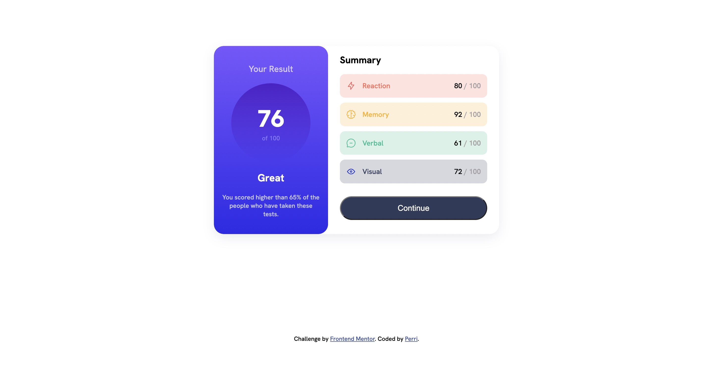

# Frontend Mentor - Results summary component solution

This is a solution to the [Results summary component challenge on Frontend Mentor](https://www.frontendmentor.io/challenges/results-summary-component-CE_K6s0maV). Frontend Mentor challenges help you improve your coding skills by building realistic projects. 

## Table of contents

- [Overview](#overview)
  - [Screenshot](#screenshot)
  - [Links](#links)
- [My process](#my-process)
  - [Built with](#built-with)
  - [What I learned](#what-i-learned)
  - [Useful resources](#useful-resources)
- [Author](#author)


## Overview


### Screenshot



Screenshot of my solution. 

### Links

- Solution URL: [Add solution URL here](https://your-solution-url.com)
- Live Site URL: [Add live site URL here](https://your-live-site-url.com)

## My process

### Built with

- Semantic HTML5 markup
- CSS custom properties
- Flexbox
- CSS Grid
- Mobile-first workflow


### What I learned

How to vertically center svg
```html
<div class="title-container">
  <svg xmlns="http://www.w3.org/2000/svg" width="20" height="20" fill="none" viewBox="0 0 20 20"><path stroke="#F55" stroke-linecap="round" stroke-linejoin="round" stroke-width="1.25" d="M10.833 8.333V2.5l-6.666 9.167h5V17.5l6.666-9.167h-5Z"/></svg>
  <p>Reaction</p>
</div>
```
```css
.title-container {
    display: flex;
    height: 100%;
    align-items: center;
}
```

### Useful resources

- [Animate.css](https://animate.style/) - This helped me create bouncy text animation.
- [ScrollReveal](https://scrollrevealjs.org/) - This helped me create scroll in animation.

## Author

- Frontend Mentor - [@NotPerr](https://www.frontendmentor.io/profile/NotPerr)
- Twitter - [@NotPerry8811](https://www.twitter.com/NotPerry8811)

